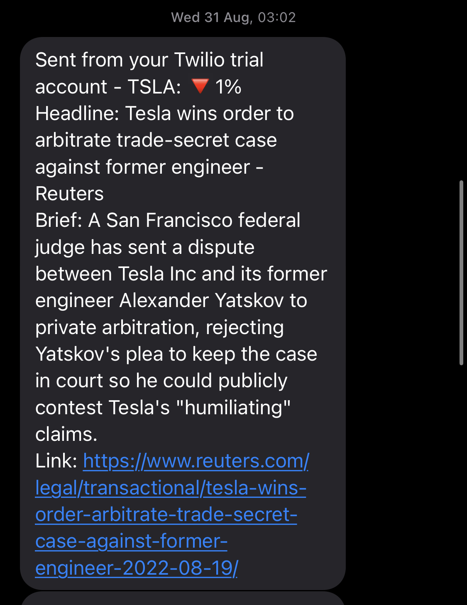

# 📈 Stock Price SMS Notifier using Twilio

💰Do you want your money to work for you? 📊Do you want to invest but don't want to stare at charts all day long? Introducing 📈**Stock Price SMS Notifier**✨: an automated SMS notification application that alerts you whenever the prices of your target tickers go over or under the limit. The current version of the project can only track one ticker.



## API Requirements

You will need to create accounts to get account IDs and API keys in order to gain access to the necessary APIs.

- Twilio Account Id: `TWILIOACCSID`
- Twilio Auth Token: `TWILIOAUTHTOKEN`
- Twilio From Number: `FROMNUMBER`
- Twilio To Number: `TONUMBER`
- Alphavantage API Key: `AVAPI`
- NewsAPI.org Key: `NEWSAPI`

After getting the tokens, insert into their corresponding variables and save them in the shell script `.envvar`. Before running the program, run the following command to load the tokens into the environment variables.
```
source .envvar
``` 

Resources:

- [Try Twilio Free](https://www.twilio.com/try-twilio)
- [Get Alphavantage.co API Key](https://www.alphavantage.co/support/#api-key)
- [Get NewsAPI.org API Key](https://newsapi.org/register)

## Installation

The only additional module you need to install is Twilio client-side API. You can explicitly run `pip install twilio` to install the latest version of the API or run the following command to install from `requirements.txt`

```
pip install -r requirements.txt
```

## How to Use

After loading the necessary environment variables from `.envvar`, the application is ready to run. There are 3 main configurable constants: `STOCK` is the label ticker for identifying target stock using [Alphavantage Stock API](https://www.alphavantage.co/documentation/), `COMPANY_NAME` is the full name of the company for searching through headlines with [News API](https://newsapi.org/docs), and `THRESHOLD` is the limit in the difference between yesterday and the day before's closing prices as a ratio. You can configure these parameters directly in the `main.py` before running your program.

You can also set create a repeating task to run on Twilio to automate the application to run and daily.